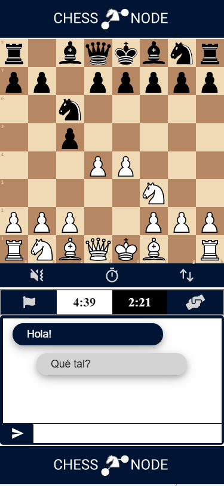
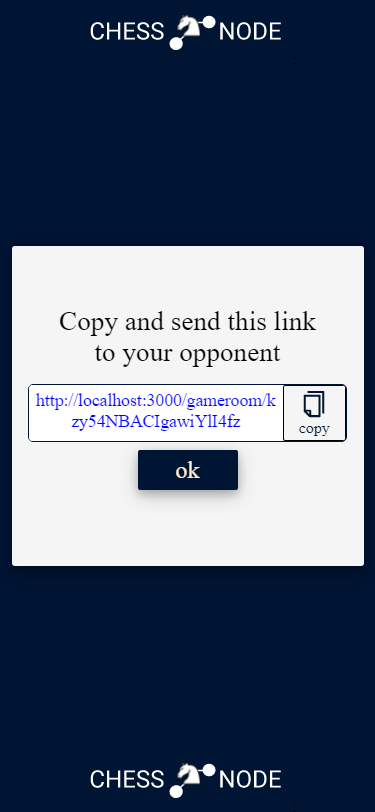
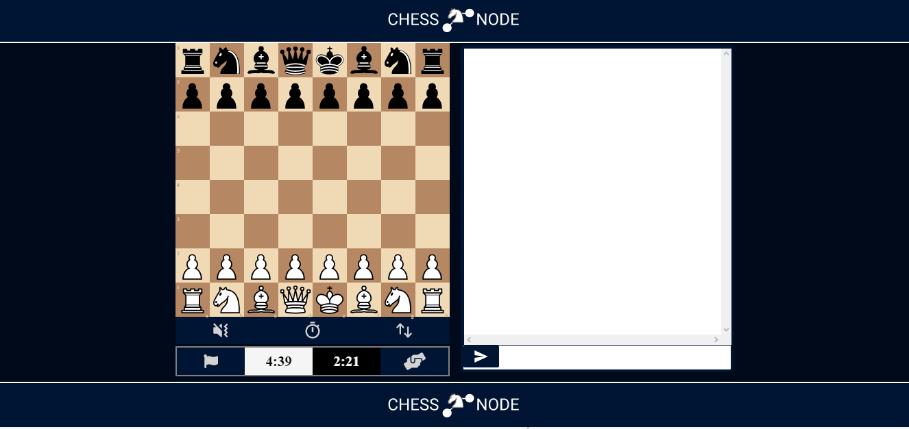
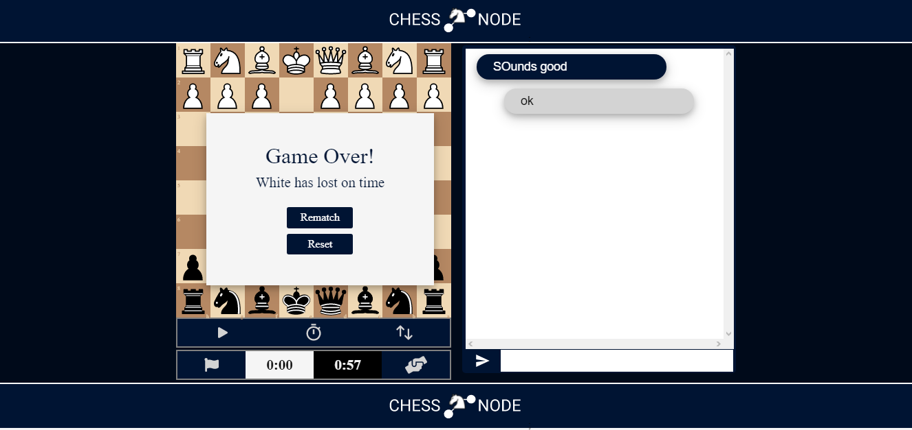

# CHESS NODE

    Online multiplayer chess game with live chat.

## Start the app

    1. RUN `npm run dev` in the server forder
    2. RUN `npm npm start` in the client folder

## Funtionality

- [x] Users can play chess online with each other
- [x] Users can create an invitation link witch can be sent to a non registerd friend in order to play.
- [x] An espectator can enter using the invitation link and watch the game.
- [x] Users can talk to each other via live chat during the game
- [x] Users can resign a game
- [x] Users can send and accept draw offers
- [x] Users can rematch
- [x] The pieces can be moved via drag and drop or by click on squares
- [x] UI is respondive
- [x] chess clock

  
  

## To be devloped

- [ ] Solve odd warnings
- [ ] select promotion piece instead of auto-queen
- [ ] change board color
- [ ] sound integration
- [ ] Cache garbage collector for the room sesions
