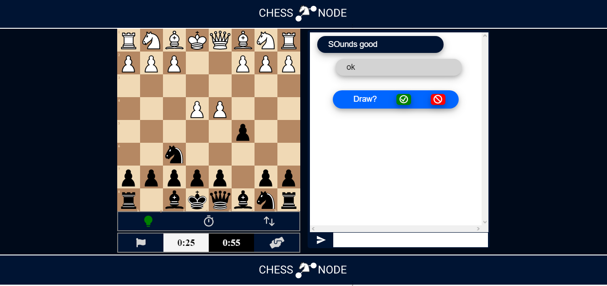
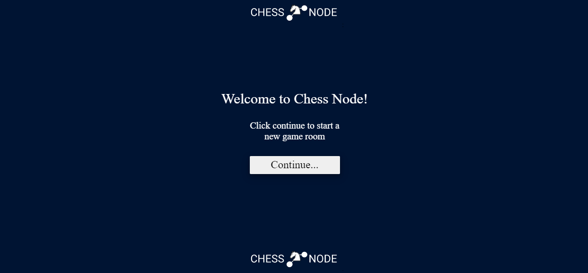

# CHESS NODE

    Online multiplayer chess game with live chat.

## start the app

    1. RUN `npm run dev` in the server forder
    2. RUN `npm npm start` in the client folder

## Funtionality

- [x] Users can play chess online with each other
- [x] Users can create an invitation link witch can be sent to non registerd friend in order to play.
- [x] An espectator can enter using the invitation link and watch the game.
- [x] Users can talk to each other via live chat during the game
- [x] Users can resign a game
- [x] Users can send and accept draw offers
- [x] Users can send and accept rematch offers
- [x] The pieces can be moved via drag and drop or by click on individual squares
- [x] UI is respondive

## To be devloped

- [ ] start game functionality
- [ ] rematch offer and accept functionality
- [ ] resignation functionality
- [ ] draw offer and accept functionality
- [ ] game over functionality
- [ ] tostify/comunication functionality
- [ ] imagenes de portada readme

- [ ] clock funtionality
- [ ] Promotion selection
- [ ] Cache garbage collector
- [ ] sounds f
